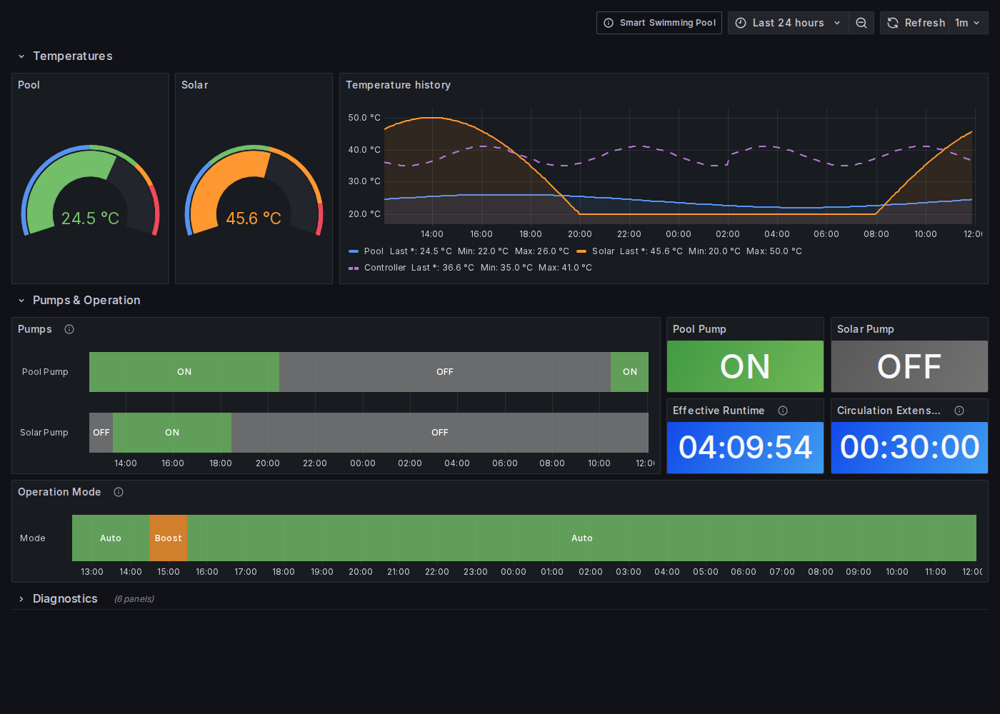

# Grafana Dashboard | 🏊 Smart Swimming Pool

[](https://github.com/smart-swimmingpool)
[](https://opensource.org/licenses/MIT)

Grafana dashboard for the [Smart Swimming Pool](https://smart-swimmingpool.com)
[Pool Controller](https://github.com/smart-swimmingpool/pool-controller) **v5.x**.
It shows pool and solar temperatures, pump switching times, the operation mode and
controller diagnostics over time.



---

## ✨ How It Works

```text
Pool Controller ──MQTT discovery──▶ Home Assistant ──InfluxDB integration──▶ InfluxDB ──▶ Grafana
```

The Pool Controller publishes its entities via
[Home Assistant MQTT discovery](https://www.home-assistant.io/integrations/mqtt/#mqtt-discovery).
Home Assistant's [InfluxDB integration](https://www.home-assistant.io/integrations/influxdb/)
stores their states in InfluxDB, and the dashboard queries this database with InfluxQL.

## 📊 Panels

| Section | Panel | Pool Controller entity |
|---------|-------|------------------------|
| Temperatures | Pool / Solar gauges | `sensor.pool_controller_pool_temperature`, `sensor.pool_controller_solar_temperature` |
| | Temperature history | pool, solar and controller temperature |
| Pumps & Operation | Pumps (state timeline) | `switch.pool_controller_pool_pump`, `switch.pool_controller_solar_pump` |
| | Pool Pump / Solar Pump | current switch state |
| | Effective Runtime | `sensor.pool_controller_effective_runtime` |
| | Circulation Extension | `sensor.pool_controller_circulation_extension` |
| | Operation Mode | `select.pool_controller_operation_mode` (auto, manu, boost, timer) |
| Diagnostics (collapsed) | WiFi Signal, Uptime, Free Heap, Controller Temperature + history | `rssi`, `system_uptime`, `free_heap_space`, `controller_temperature` sensors |

## 🚀 Installation

### Prerequisites

| Component | Version |
|-----------|---------|
| Pool Controller | v5.x (Home Assistant MQTT discovery) |
| Home Assistant | with the [MQTT](https://www.home-assistant.io/integrations/mqtt/) and [InfluxDB](https://www.home-assistant.io/integrations/influxdb/) integrations |
| InfluxDB | 1.x, or 2.x with InfluxQL (DBRP mapping) |
| Grafana | 10 or newer (tested with 11.6) |

### 1. Store the pool data in InfluxDB

Enable the InfluxDB integration in Home Assistant's `configuration.yaml` with the default
measurement settings (`measurement_attr: unit_of_measurement`), for example:

```yaml
influxdb:
  host: influxdb.local
  database: home_assistant
  include:
    entity_globs:
      - sensor.pool_controller_*
      - switch.pool_controller_*
      - select.pool_controller_*
```

With these defaults, Home Assistant writes values with a unit to a measurement named after
the unit (`°C`, `s`, `dBm`, `B`) and tags them with `entity_id`. Switches and selects have
no unit and are written to a measurement named after the entity
(e.g. `switch.pool_controller_pool_pump`) with the fields `value` (1/0) and `state` (`on`/`off`).

### 2. Import the dashboard

1. In Grafana, add an **InfluxDB** data source (query language **InfluxQL**) pointing to the
   database used by Home Assistant.
2. Open **Dashboards → New → Import** and upload
   [`dashboard-smart-swimming-pool.json`](dashboard-smart-swimming-pool.json).
3. Select the InfluxDB data source when asked and click **Import**.

### Renamed entities

The dashboard uses the entity ids Home Assistant creates by default for the device
"Pool Controller". If you renamed entities, adjust the hidden variables under
**Dashboard settings → Variables** (e.g. `pool_temp`, `pool_pump`, `operation_mode`).
Enter the entity id without the domain, e.g. `pool_controller_pool_temperature`.

> If Home Assistant uses imperial units, temperatures are stored in the measurement `°F`.
> Replace `°C` in the temperature queries in that case.

## 🗂️ Legacy openHAB Dashboard

[`dashboard-smart-swimming-pool-openhab-legacy.json`](dashboard-smart-swimming-pool-openhab-legacy.json)
is the original dashboard for Pool Controller v1/v2 with
[openHAB](https://github.com/smart-swimmingpool/openhab-config) InfluxDB persistence
(items `Pool_Controller_PoolTemp_Temperature`, `Pool_Controller_PoolPump_Switch`, ...).
It is kept unchanged for existing installations.

## 🛠️ Development

The dashboard JSON is generated by [`scripts/generate_dashboard.py`](scripts/generate_dashboard.py).
Change the script instead of editing the JSON by hand and regenerate it:

```bash
python3 scripts/generate_dashboard.py > dashboard-smart-swimming-pool.json
```

Before submitting a pull request:

- Validate the JSON: `python3 -m json.tool dashboard-smart-swimming-pool.json > /dev/null`
- Import the dashboard into Grafana and check that all panels show data

See [CONTRIBUTING.md](CONTRIBUTING.md) for general guidelines.

## 📜 License

[MIT License](LICENSE) – free to use, modify and share.

## 📢 Related Projects

| Project | Description |
|---------|-------------|
| [Pool Controller](https://github.com/smart-swimmingpool/pool-controller) | ESP32 based control unit with Home Assistant MQTT discovery |
| [Pool Monitor](https://github.com/smart-swimmingpool/monitor) | E-ink temperature display |
| [openHAB Config](https://github.com/smart-swimmingpool/openhab-config) | openHAB configuration files |
| [Website](https://smart-swimmingpool.com) | Project documentation |

Questions or problems? Open an [issue](https://github.com/smart-swimmingpool/grafana-dashboard/issues).
